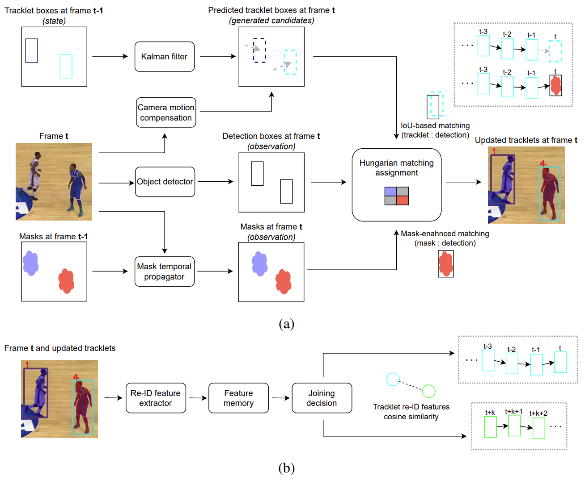

# McByte++
Faster and enhanced version of [McByte](https://github.com/tstanczyk95/McByte). **Long-term tracking 🔥📈**

What's new:
- Person re-identification (re-ID) for recognizing subjects leaving and coming back to the scene;
- Faster, lightweight mask usage;
- Selective and improved usage of camera motion compensation (cmc).


## McByte++ visually
As you can see in the demo below, despite not performing any training or tuning on the used sequence, the subjects are well tracked and the majority of them is re-recognized upon leaving and entering back the scene (old IDs assigned). Even more improvements coming soon. Input video provided by the basketball team [Antibes Sharks Côte d'Azur](https://www.sharks-antibes.com/).

<p align="center">
  
</p>

Official implementation of the paper:

>**[Training-Free Long-Term Multi-Object Tracking for Sports Video Analytics](https://arxiv.org/pdf/2608.15688)**
>
>[Tomasz Stanczyk](https://www.linkedin.com/in/tomasz-stanczyk/) (first author, code creator), Seongro Yoon, [Francois Bremond](https://www-sop.inria.fr/members/Francois.Bremond/)
>
>[*arxiv 2608.15688*](https://arxiv.org/abs/2608.15688)

<p align="center">
  <a href="https://team.inria.fr/stars/">
    
  </a>
  <a href="https://3ia.univ-cotedazur.eu/">
    
  </a>
</p>

Designed and developed at Inria, in the <a href="https://team.inria.fr/stars/">STARS team</a>.

## Abstract
Long-term multi-object tracking in sports remains challenging due to frequent occlusions, rapid camera motion, and repeated player reappearances. We introduce McByte++, a training-free tracking-by-detection framework that integrates lightweight mask propagation, conditional camera motion compensation, and online re-identification within a unified pipeline. Compared to its predecessor, McByte++ substantially improves runtime efficiency while enhancing identity preservation. On SoccerNet-tracking and SportsMOT benchmarks, McByte++ achieves up to +3.0 HOTA and +6.1 IDF1 improvements over the original McByte in the online setting, with further gains when combined with offline global association. Replacing heavy segmentation components and optimizing motion modeling yields up to an order-of-magnitude speed increase. All results are obtained without detector retraining or dataset-specific tuning.

<p align="center">
  
</p>


## Installation and models

Please follow the complete guideline in [INSTALLATION.md](https://github.com/tstanczyk95/McBytePlusPlus/blob/main/INSTALLATION.md).
<br/>

## 🔥 Demo 🔥

### Simply run the command - no training required:
With re-ID:
```
python tools/demo_track__with_reid.py --path path/to/your/input/frames
```
Without re-ID:
```
python tools/demo_track__no_reid.py --path path/to/your/input/frames
```

Input is your frame folder.<br/>
Output will be located in: <i>McBytePlusPlus/YOLOX_outputs/yolox_x_mix_det/track_vis/date_time_stamp</i>. Folder with processed frames will be created. Text output file (tracking records per frame in MOT format) will be created outside the folder.

**More arguments:**
- <i>--vis_type</i> - visualization type, it enables saving separately: frames with masks and tracklets, frames with detections and frames with tracklets before Kalman filter update. Skipping the visualization, while keeing the text (records) output is also possible. Recognized values: <i>full</i> (frame/image input only), <i>basic</i>, <i>no_vis</i>. Default: <i>basic</i>.
- <i>-f</i> | <i>--exp_file</i> - the name of the YOLOX detector experiment (architecture and parameters) file. Although several ones are possible, we recommend staying with the default: <i>exps/example/mot/yolox_x_mix_det.py</i>. 
- <i>-c</i> | <i>--ckpt</i> - the name of the object detector pretrained weights file (the checkpoint). It must match the architecture from the experiment file above (e.g. YOLOX X). Default: <i>pretrained/yolox_x_sports_mix.pth.tar</i>.
- <i>--det_path</i> - path to the text file with detections. Default: None. If specified, detector-related arguments will not be considered. See the expected format [here](https://github.com/tstanczyk95/McBytePlusPlus/blob/main/tools/demo_track__with_reid.py#L332) or slightly adjust it to yours.
- <i>--cmc_downscale</i> - the downscale factor of the camera motion compensation input. The higher the factor, the less computing is required, but also less precision. The most optimal value for the evaluated datasets was 4 (set as default).

**Re-ID arguments (<i>demo_track__with_reid.py only</i>):**
- <i>--reid_model_path</i> - the name of the re-ID pretrained weights file (the checkpoint). Default: deep-person-reid/pretrained/sports_model.pth.tar-60.
- <i>--reid_sim_thresh</i> - the similarity threshold of the re-ID features to be considered of the same subject (see more details below). Default value: 0.8. 


**Additional note**: The YOLOX object detector model pretrained on [SportsMOT](https://github.com/MCG-NJU/SportsMOT) as provided by the dataset authors (used as default setting above) behaves very well on the considered sport settings - soccer, basketball, volleyball 🔥

For a complete list of arguments, run:
```
python tools/demo_track.py --help
```

### Exemplary run commands on the evaluated datasets:
SoccerNet-tracking 2022:
```
python tools/demo_track__with_reid.py --path /your/path/SoccerNet/tracking/test/SNMOT-139/img1/ --det_path /your/path/datasets/SoccerNet/tracking/test/SNMOT-139/det/det.txt
```
SportsMOT:
```
python tools/demo_track__with_reid.py --path /your/path/sportsmot/test/v_-9kabh1K8UA_c008/img1
```
DanceTrack:
```
python tools/demo_track__no_reid.py --path /your/path/dancetrack/test/dancetrack0003/img1/ -c pretrained/bytetrack_x_dancetrack.pth.tar 
```


## McByte vs. McByte++ performance comparison

As presented below, McByte++ is a faster and enhanced version of McByte, especially when used with re-ID. Using re-ID involves additional computation, hence both, the variant with and without it is provided and compared. 

McByte++ performs long-term re-ID online, during tracking, without requiring offline post-processing. For completeness, we additionally report results obtained by applying an external offline global association method to the McByte++ outputs; these results are explicitly marked in the tables below. See the "Re-ID" joining section below for more details on the re-ID mechanism and model.

### SoccerNet-tracking 2022 - test split

| Method | HOTA ↑ | IDF1 ↑ | MOTA ↑ | FPS ↑ |
|---|---:|---:|---:|---:|
| McByte | 85.0 | 79.9 | 96.8 | 1.04 |
| McByte++, no re-ID | 84.1 | 78.9 | 97.1 | 10.71 |
| McByte++, with online re-ID | 87.5 | 84.5 | 97.1 | 8.69 |
| McByte++ + GTA-link (offline post-processing) | 88.6 | 87.2 | 97.1 | 7.46 |

### SportsMOT - test split

| Method | HOTA ↑ | IDF1 ↑ | MOTA ↑ | FPS ↑ |
|---|---:|---:|---:|---:|
| McByte | 76.9 | 77.5 | 97.2 | 3.60 |
| McByte++, no re-ID | 75.8 | 76.0 | 96.9 | 19.08 |
| McByte++, with online re-ID | 79.9 | 83.6 | 96.9 | 14.57 |
| McByte++ + GTA-link (offline post-processing) | 81.5 | 86.0 | 96.8 | 12.49 |

### SoccerNet-tracking - challenge 2023 split

SportsMOT-pretrained YOLOX detector (McByte++ default setting).

| Method | HOTA ↑ | IDF1 ↑ | MOTA ↑ | FPS ↑ |
|---|---:|---:|---:|---:|
| McByte | 64.1 | 76.5 | 81.8 | 1.46 |
| McByte++, no re-ID | 62.4 | 74.1 | 81.7 | 15.05 |
| McByte++, with online re-ID | 64.3 | 78.6 | 81.8 | 11.13 |
| McByte++ + GTA-link (offline post-processing) | 65.7 | 80.7 | 81.7 | 10.06 |

### DanceTrack - test split

| Method | HOTA ↑ | IDF1 ↑ | MOTA ↑ | FPS ↑ |
|---|---:|---:|---:|---:|
| McByte | 67.1 | 68.1 | 92.9 | 2.00 |
| McByte++, no re-ID | 64.4 | 66.0 | 92.2 | 26.44 |
| McByte++, with online re-ID | 64.5 | 67.8 | 92.2 | 20.23 |
| McByte++ + GTA-link (offline post-processing) | 65.2 | 68.3 | 91.5 | 16.55 |

<i>*In case of DanceTrack, the re-ID doesn't help as much, because people stay mostly on the scene. Furthermore, the used re-ID model was primarily trained on sports such as soccer, basketball, volleyball. On the other hand, the speed up on DanceTrack between McByte and McByte++ is the most remarkable one.</i>

<i>**FPS was measured on a single NVIDIA H100 GPU. In case of GTA-link post-processing, the total processing time was measured and used as the score denominator (frames per **second**). FPS measurement was performed exclusively for tracking, excluding the detection part. Detections on the evaluated datasets were extracted separately and fed to McByte.</i>

<i>***Even more optimized (faster) version is already in preparation.</i>


## Re-ID joining

### Tracklet joining and thresholds (<i>demo_track__with_reid.py only</i>)

The re-ID is used to join the tracklets of the subjects which leave and come back to the scene. Every time a new subject appears on the scene (within the camera view/frame), their visual features are computed and compared with those of the already tracked entities (existing tracklets), who are currently missing on the scene. If the cosine similarity between the new entity and an already tracked entity is high enough, i.e. above or equal to the set threshold <i>--reid_sim_thresh</i>, the new entity is considered as the existing one and receives the same ID.

E.g. subject with ID=3 leaves the scene. A new subject appears. If they are considered visually similar enough, the new subject obtains ID=3. Otherwise, they receive a new ID which hasn't been used yet, e.g. ID=25.

The default threshold, used together with the sport re-ID model (sports_model.pth.tar-60) is set by default as 0.8 (minimal cosine similarity of 0.8 required), as this is the optimal value found on the evaluated datasets with this model. If you change your data, you might want to try different values of this threshold. If you train your own re-ID model on your data, you will most likely need to update this value based on the observed performance (e.g. visual outputs or re-ID joining logs in the console).

### Re-ID model

The default sports re-ID weights originate from [GTA-link](https://github.com/sjc042/gta-link). McByte++ uses this re-ID model within its own online identity-recovery mechanism; GTA-link itself is an offline post-processing method and is not required to run McByte++. For comparison, we additionally report results obtained by applying GTA-link to McByte++ outputs.

You can also train [Deep-person-reid (torchreid)](https://github.com/kaiyangzhou/deep-person-reid) on your data and plug it directly into McByte++ to receive even stronger performance.


## Mask propagation note

Note that due to the nature of the original [EdgeTAM](https://github.com/facebookresearch/EdgeTAM) implementation, the currect version of McByte++ needs to load all the frames at once to process the temporally propagated masks. An improvement including processing the frames one bye one is already considered and will be added with the next versions.


## Acknowledgement
McByte++ is a modified and extended version of [McByte](https://github.com/tstanczyk95/McByte), with the large part of the latter's code was borrwed from [ByteTrack](https://github.com/FoundationVision/ByteTrack), [YOLOX](https://github.com/Megvii-BaseDetection/YOLOX) and [Cutie](https://github.com/hkchengrex/Cutie). [EdgeTAM](https://github.com/facebookresearch/EdgeTAM) model was smoothly incorporated and some additional parts were borrowed from [BoT-SORT](https://github.com/NirAharon/BoT-SORT). [Deep-person-reid (torchreid)](https://github.com/kaiyangzhou/deep-person-reid) was used for tracklet re-ID joining with some parts borrowed from [GTA-link](https://github.com/sjc042/gta-link/). Many thanks to all the authors for their amazing work! 


## Usage and citation

If you find this work useful, consider leaving us a star 🌟 and please cite it in your research paper as follows: 

```
@misc{stanczyk2026trainingfreelongtermmultiobjecttracking,
      title={Training-Free Long-Term Multi-Object Tracking for Sports Video Analytics}, 
      author={Tomasz Stanczyk and Seongro Yoon and Francois Bremond},
      year={2026},
      eprint={2608.15688},
      archivePrefix={arXiv},
      primaryClass={cs.CV},
      url={https://arxiv.org/abs/2608.15688}, 
}
```